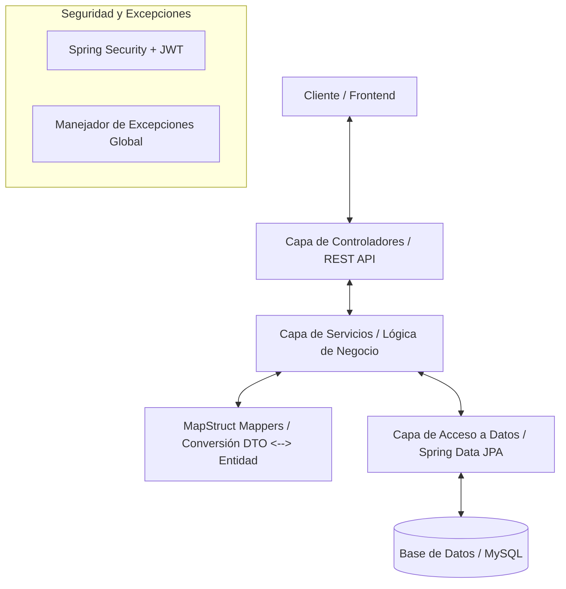

# Revisión Arquitectónica y Auditoría de Código
**Proyecto:** Plataforma de Seguros (Spring Boot)

---

## 1. Resumen General del Proyecto
Este proyecto es una **API REST** moderna construida con **Spring Boot 3.5.x** y **Java 21**. Su objetivo es dar soporte al backend de una plataforma de administración de seguros (`plataforma_seguros`). 

Permite coordinar de forma integral:
1. **Usuarios y Autenticación:** Soporte multi-rol (Clientes, Supervisores, Administradores) con seguridad basada en tokens JWT.
2. **Catálogo de Productos:** Gestión de tipos de pólizas/productos de seguros disponibles.
3. **Pólizas:** Registro y vigencia de las pólizas adquiridas por los clientes.
4. **Aliados (Partners):** Administración de talleres, clínicas y proveedores externos.
5. **Reclamaciones (Claims):** Gestión del ciclo de vida de siniestros, enlazando cliente, póliza activa, aliado asignado para el servicio y un supervisor encargado de la aprobación.

---

## 2. Arquitectura y Stack Tecnológico

El proyecto está diseñado siguiendo una **Arquitectura en Capas (Layered Architecture)** tradicional y limpia:



### Stack de Componentes:
* **Java 21 / Spring Boot 3.5.14** (Aprovecha características modernas de JDK y dependencias actualizadas).
* **Spring Data JPA & Hibernate** para la persistencia.
* **MySQL** como base de datos relacional.
* **Flyway** para control de versiones y migraciones de esquemas base de datos (`db/migration`).
* **MapStruct 1.5.5** para mapeo eficiente y libre de boilerplate entre entidades de dominio y DTOs.
* **Lombok** para reducir código repetitivo (Getters, Setters, constructores).
* **Spring Security & JJWT 0.12.3** para autenticación stateless.
* **SpringDoc OpenAPI (Swagger)** para la autogeneración de la especificación técnica de la API.

---

## 3. Evaluación de Buenas Prácticas

### Puntos Fuertes Detectados (Estándar Enterprise)
* **Aislamiento del Dominio:** El uso sistemático de DTOs separados para peticiones de creación (`RequestDTO`), actualizaciones (`UpdateDTO`) y respuestas (`ResponseDTO`) es excelente. Protege las entidades JPA de exposiciones accidentales.
* **Control de Excepciones Centralizado:** El uso de `@RestControllerAdvice` en [GlobalExceptionHandler](file:///C:/Users/HP/Downloads/insurance-platform-springboot/insurance-platform-springboot/src/main/java/com/insurance_platform_springboot/excetion/GlobalExceptionHandler.java) asegura que el cliente reciba errores consistentes formateados bajo una clase [ApiError](file:///C:/Users/HP/Downloads/insurance-platform-springboot/insurance-platform-springboot/src/main/java/com/insurance_platform_springboot/excetion/ApiError.java).
* **Gestión Declarativa de Transacciones:** Uso adecuado de `@Transactional` para operaciones de escritura y `@Transactional(readOnly = true)` para lecturas, lo cual optimiza el rendimiento en la sesión de Hibernate.
* **Migraciones Estrictas:** Flyway garantiza consistencia entre entornos y el parámetro `spring.jpa.hibernate.ddl-auto=validate` previene discrepancias de esquema.

---

### Puntos de Atención y Fallos de Nomenclatura (Issues)

1. **Typo en Nombre de Paquete Crítico (`excetion`):**
   El paquete donde residen las excepciones está nombrado como `com.insurance_platform_springboot.excetion` (falta la letra **p**). Este error se propaga en los archivos de importación de prácticamente todo el proyecto.
2. **Mayúsculas en Nombres de Paquetes (`model.Enum`):**
   El paquete `com.insurance_platform_springboot.model.Enum` inicia con mayúscula. Las convenciones estándar de Java dictan que todos los nombres de paquetes deben ser en minúsculas (ej: `model.enums`).
3. **Riesgo de Rendimiento por Falta de Paginación:**
   Los métodos de consulta masiva en los servicios (como `findAll()` en [PartnerService](file:///C:/Users/HP/Downloads/insurance-platform-springboot/insurance-platform-springboot/src/main/java/com/insurance_platform_springboot/service/PartnerService.java) y [ClaimService](file:///C:/Users/HP/Downloads/insurance-platform-springboot/insurance-platform-springboot/src/main/java/com/insurance_platform_springboot/service/ClaimService.java)) retornan colecciones completas (`List<T>`). Si la tabla crece a miles de registros, causará latencias de red y consumo excesivo de memoria en la JVM.
4. **Hard-deletion (Eliminación Física) vs Soft-deletion (Eliminación Lógica):**
   Los endpoints de borrado ejecutan `repository.deleteById()`. En dominios críticos como Seguros, borrar físicamente pólizas o reclamaciones destruye el historial de auditoría legal y financiera.
5. **Secreto JWT Quemado (Hardcoded):**
   En [application.properties](file:///C:/Users/HP/Downloads/insurance-platform-springboot/insurance-platform-springboot/src/main/resources/application.properties), `app.jwt.secret` tiene una firma directa en texto plano. Aunque es conveniente para desarrollo local, es un riesgo severo de seguridad en repositorios de código.

---

## 4. Plan de Acción y Mejoras Recomendadas

### Fase 1: Corrección de Nomenclatura (Refactor)
* Renombrar el paquete `com.insurance_platform_springboot.excetion` a `com.insurance_platform_springboot.exception` y actualizar todos sus imports.
* Renombrar el paquete `com.insurance_platform_springboot.model.Enum` a `com.insurance_platform_springboot.model.enums`.

### Fase 2: Robustez y Escalabilidad (Paginación)
* Cambiar las firmas de lectura general en controladores y servicios para aceptar parámetros de paginación (`Pageable`) y retornar `Page<DTO>` en lugar de `List<DTO>`.
  * *Ejemplo:*
  ```java
  public Page<ClaimResponseDTO> findAll(Pageable pageable) {
      return claimRepository.findAll(pageable).map(claimMapper::toResponse);
  }
  ```

### Fase 3: Auditoría y Borrado Lógico (Soft Delete)
* Introducir un campo `boolean active = true` o `LocalDateTime deletedAt` en las entidades críticas ([Partner](file:///C:/Users/HP/Downloads/insurance-platform-springboot/insurance-platform-springboot/src/main/java/com/insurance_platform_springboot/model/Partner.java), [Claim](file:///C:/Users/HP/Downloads/insurance-platform-springboot/insurance-platform-springboot/src/main/java/com/insurance_platform_springboot/model/Claim.java)).
* Configurar las entidades con las anotaciones `@SQLDelete(sql = "UPDATE partner SET active = false WHERE id = ?")` y `@Where(clause = "active = true")` de Hibernate para automatizar el comportamiento.

### Fase 4: Seguridad y Externalización
* Externalizar el secreto JWT para que sea leído desde variables de entorno y proveer una clave por defecto solo para desarrollo local:
  ```properties
  app.jwt.secret=${JWT_SECRET:zdtlYpXvS6v8m4b9q2w5z8x3c1v4b7n0m1a4s7d0f3g6h9j2k5l8p1o4i7u0y3t6}
  ```
